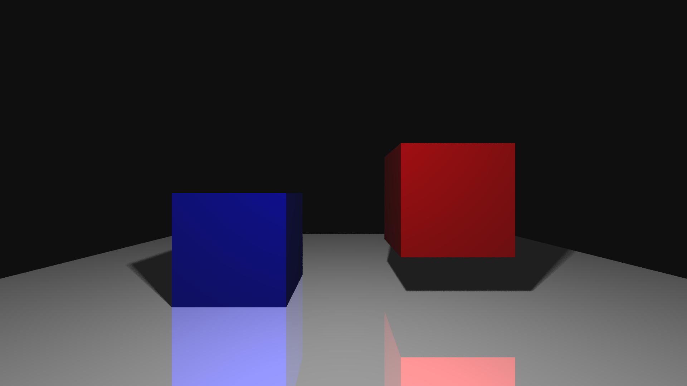

# Raytracer
I created this raytracer from scratch as a weekend project, because we were doing ray tracing at my university and I wanted to better understand the topic.

The raytracer is written in Java and is able to read an `OBJ` file format (as defined [here](http://paulbourke.net/dataformats/obj/)) and read a `MTL` material file (as defined [here](http://paulbourke.net/dataformats/mtl/)). It only uses the vertex, vertex normal and face definition, as other data is not needed. When exporting `OBJ` file the faces must first be triangulated.

## Usage
To use, first compile the `Raytracer.java` file, then run it.
```
javac Raytracer.java
java Raytracer
```

## Examples
Examples can be found in the `renders` folder.



## Tasks
  * [x] Write custom `Vector3` class that is used to represent vectors and is able to do necessary vector operations for ray tracing.
  * [x] Write an `OBJ` and `MTL` file parsers, so we can import 3D models exported from other 3D software.
  * [x] Use the ray tracing algorithm to cast rays through each pixel of our camera plane and check where they intersect with our spheres on scene. I did this first as collision detection with ray is simpler.
  * [x] Use the ray tracing algorithm to cast rays through each pixel of our camera plane and check where they intersect with our triangles. The intersection in calculated using the [Möller–Trumbore intersection algorithm](https://en.wikipedia.org/wiki/M%C3%B6ller%E2%80%93Trumbore_intersection_algorithm).
  * [x] Implemented shadow ray casting, but instead of tracing only one ray, I send out multiple to get more photorealistic shadows.
  * [x] Implemented reflection ray casting, as I also wanted to render reflective planes in my scene.

## Optimizations
The raytracer is pretty slow, because when detecting collisions with ray, I am checking all possible triangles in the scene and then finding the closest one. The execution could be made faster if I used bounding volume hierarchy tree and skipped all primitives (triangles) whose axis aligned bounding boxes do not intersect with our ray.

To get more realistic results when calculating reflections, I could send multiple rays in the general direction of reflected ray, calculate the reflected colors and average them. I could also implement transparent materials using the Snell's law.

I did, however, implement the shadow rays like that. So after finding intersection of ray and triangle on scene, I send multiple rays in the direction of a light, which is not a point but rather a sphere. The sadows look more realistic this way.